# 🍔 Knight Bite Clone

A responsive front-end clone of the Knight Bite website built using **React.js**, **React Router DOM**, **HTML5**, and **CSS3**. This project recreates the original website with a modern UI and supports both **Desktop** and **Mobile** devices.

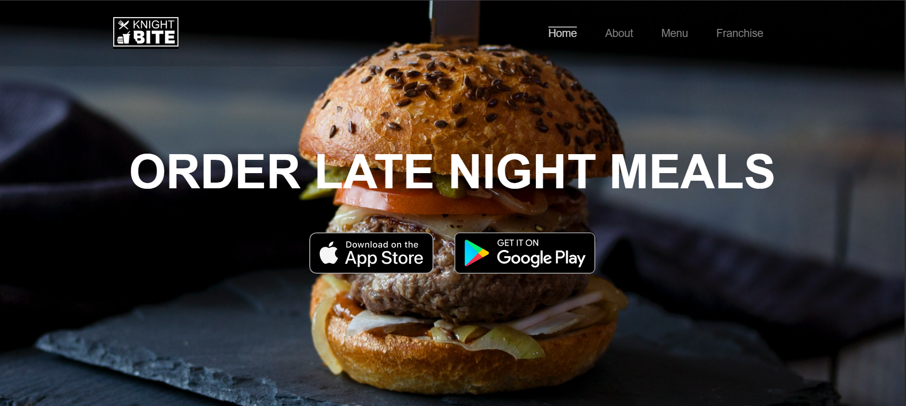

---

## 🚀 Features

- ✅ Fully Responsive Design (Desktop & Mobile)
- ✅ React Component-Based Architecture
- ✅ React Router Navigation
- ✅ Modern UI Design
- ✅ Video Background
- ✅ Responsive Navigation Bar
- ✅ Home Page
- ✅ About Page
- ✅ Menu Page
- ✅ Franchise Page
- ✅ Footer Section
- ✅ CSS Media Queries for Mobile Devices

---

## 📱 Responsive Design

This project has been optimized for different screen sizes.

### Desktop Version
- Responsive layout for large screens
- Flexbox & Grid layouts
- Large banners and images

### Mobile Version
- Mobile-friendly navigation
- Single-column layouts
- Optimized font sizes
- Responsive images
- Responsive forms
- Mobile media queries

---

## 🛠️ Technologies Used

- React.js
- React Router DOM
- HTML5
- CSS3
- JavaScript (ES6)

---

## 📂 Project Structure

```
KNIGHT_BITE/
│
├── public/
│   └── images/
│
├── src/
│   ├── assets/
│   ├── Components/
│   │   ├── Navbar.jsx
│   │   ├── Home.jsx
│   │   ├── About.jsx
│   │   ├── Menu.jsx
│   │   ├── Franchise.jsx
│   │   ├── Footer.jsx
│   │   └── navbar.css
│   │
│   ├── App.jsx
│   └── main.jsx
│
├── package.json
└── README.md
```

---

## 📄 Pages Included

### 🏠 Home
- Hero Banner
- App Download Buttons
- Features Section
- Contact Section
- Footer

### ℹ️ About
- Company Information
- Story
- Locations
- Social Media Links

### 🍟 Menu
- Burgers
- Fries & Starters
- Main Course
- Drinks
- Wraps
- Desserts

### 🤝 Franchise
- Video Background
- Mission & Vision
- Franchise Benefits
- Application Form
- Contact Details

---

## ⚙️ Installation

Clone the repository

```bash
git clone <repository-url>
```

Move into the project folder

```bash
cd KNIGHT_BITE
```

Install dependencies

```bash
npm install
```

Start the development server

```bash
npm run dev
```

Open your browser and visit

```
http://localhost:5173
```

---
## 📸 Screenshots

### 🏠 Home Page

#### Desktop


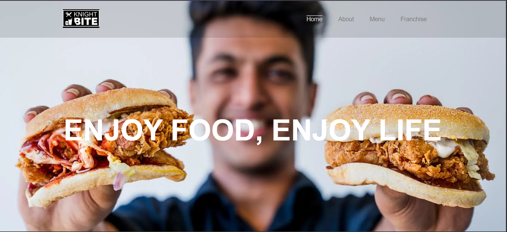

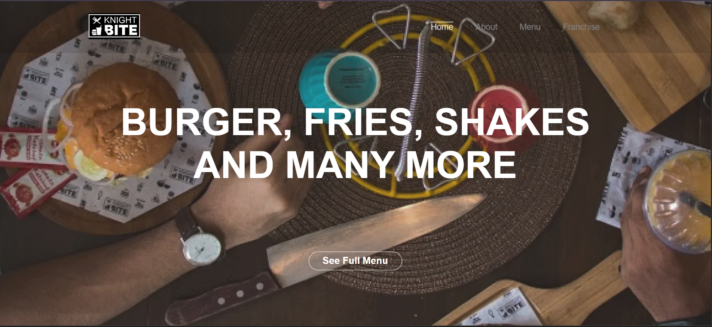

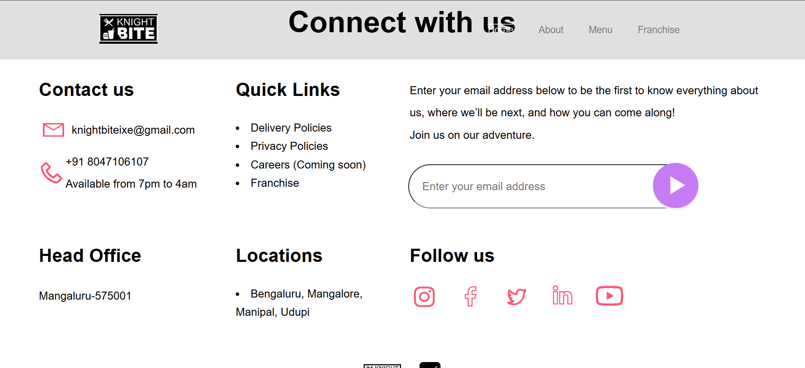

#### Mobile

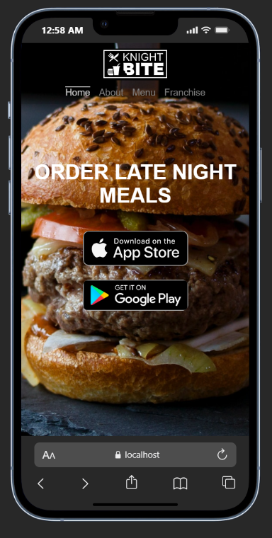

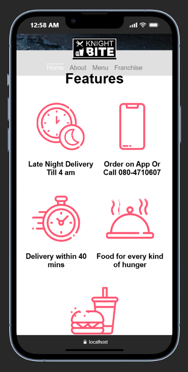

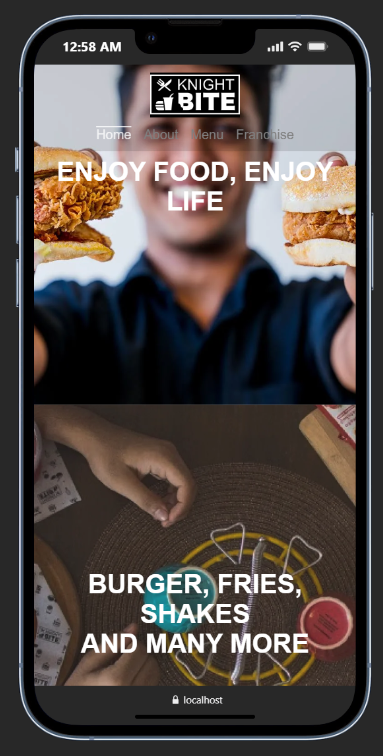

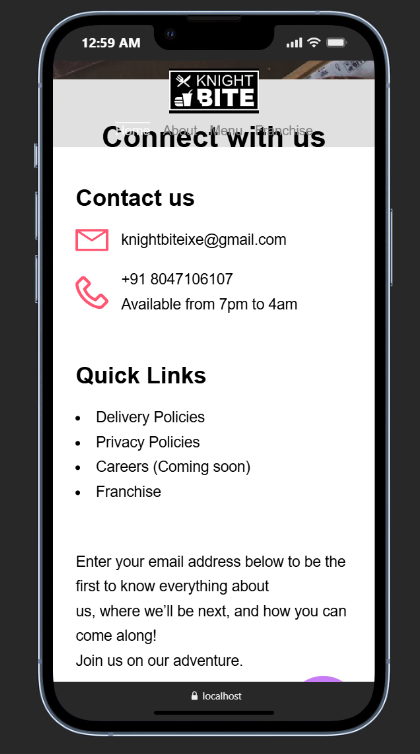

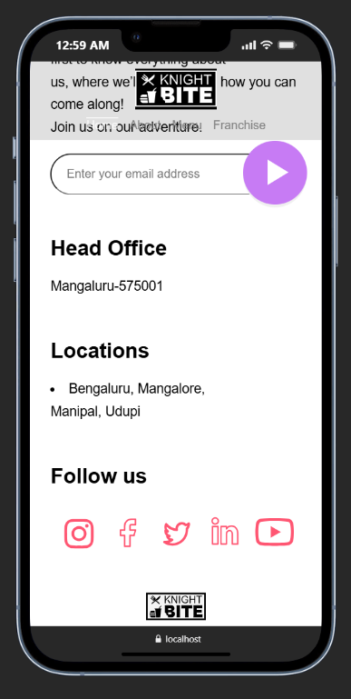

---

### ℹ️ About Page

#### Desktop

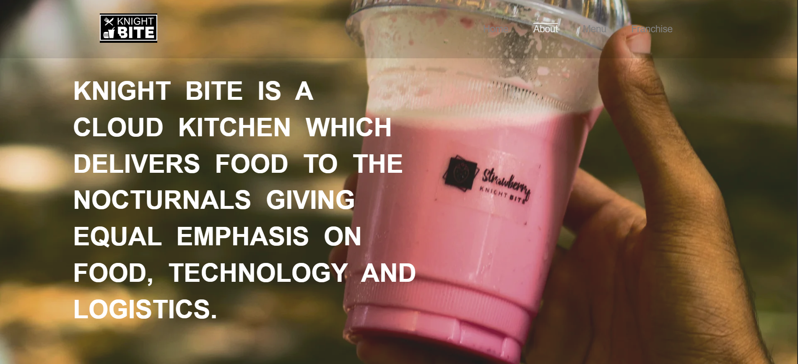

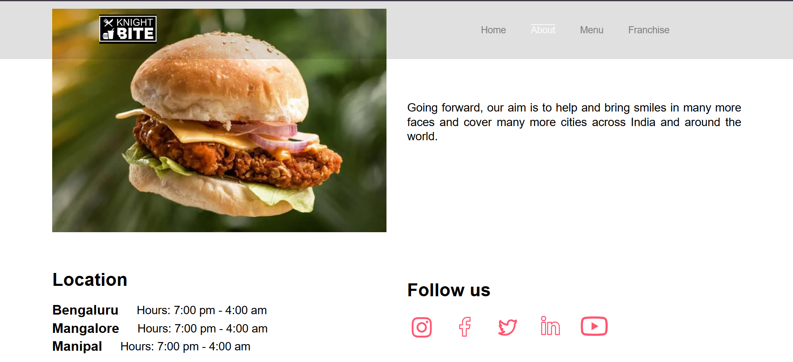

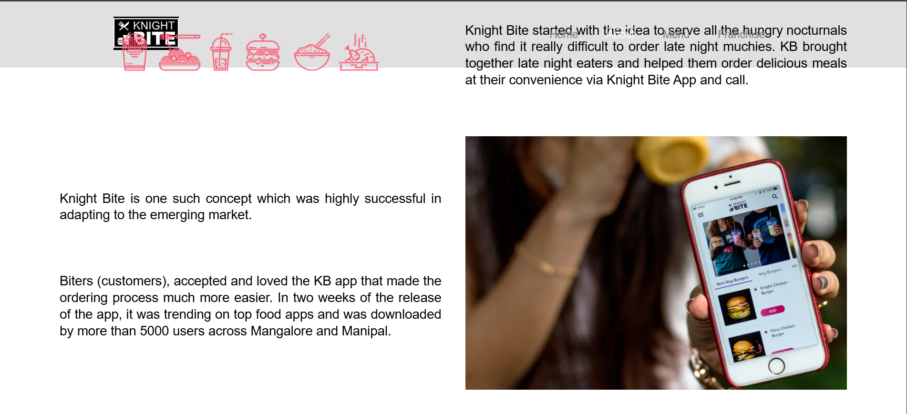

#### Mobile

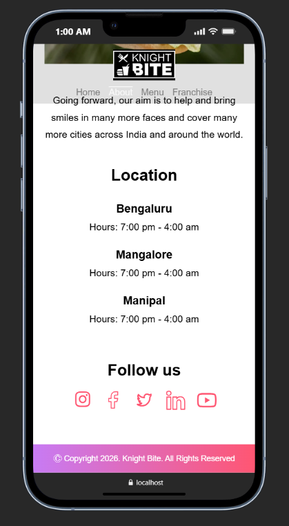

---

### 🍔 Menu Page

#### Desktop

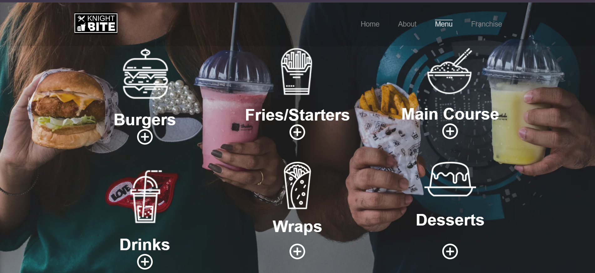

#### Mobile

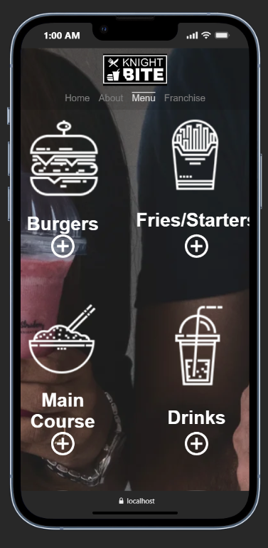

---

### 🤝 Franchise Page

#### Desktop

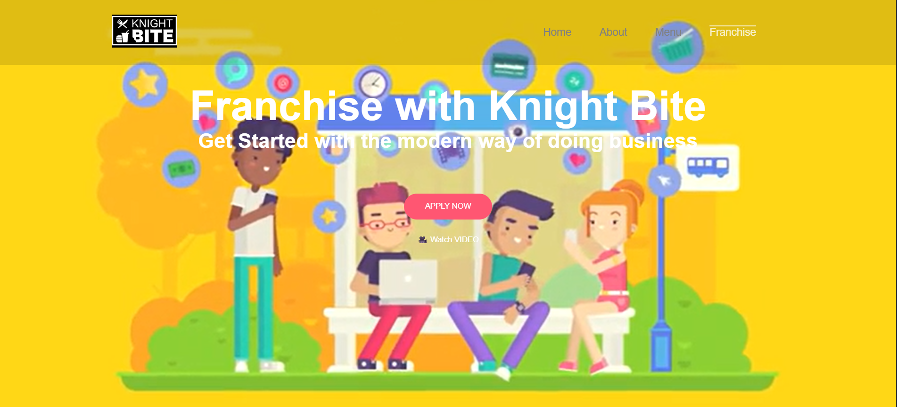

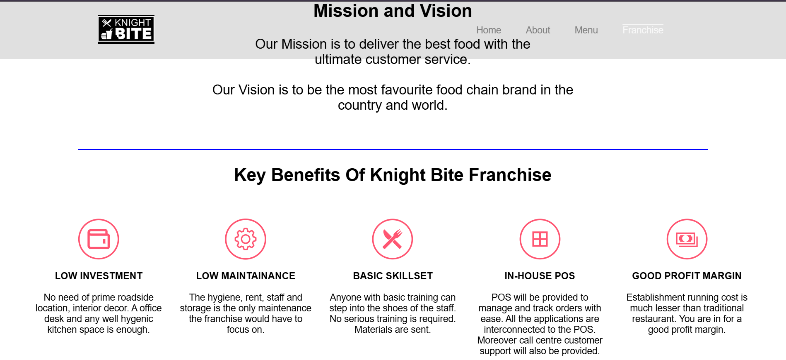

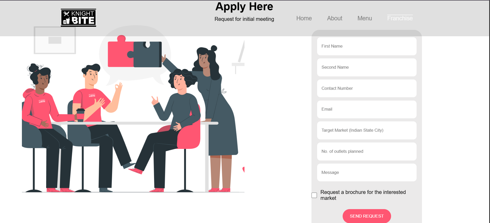

#### Mobile

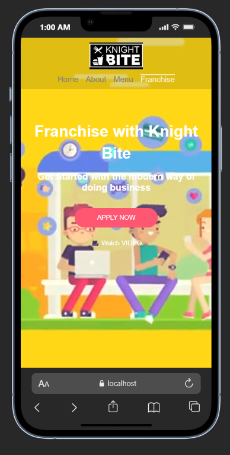

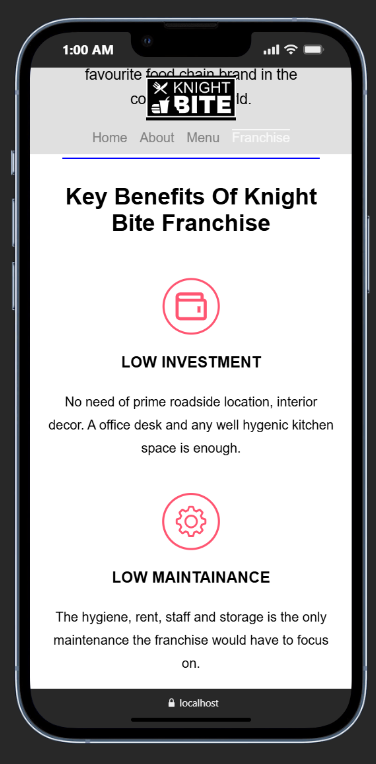

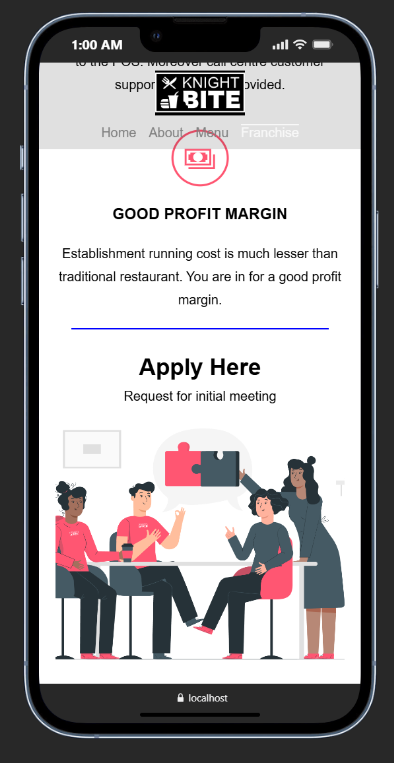

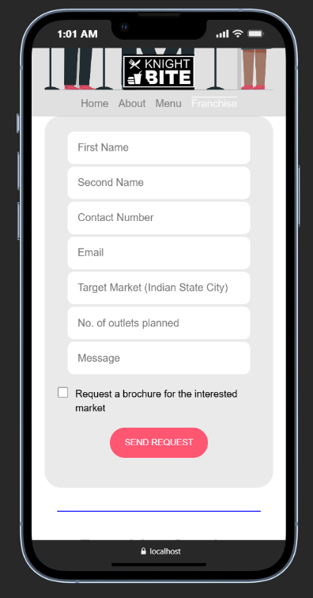

---

### 🦶 Footer

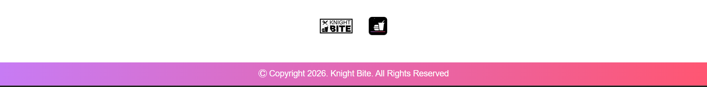

## 🎯 Learning Outcomes

This project helped me improve my knowledge of:

- React Components
- React Router DOM
- Responsive Web Design
- CSS Flexbox
- CSS Grid
- CSS Media Queries
- Component Reusability
- Website Layout Design

---

## 📌 Future Improvements

- Add animations
- Dark Mode
- Backend Integration
- Online Ordering
- Form Validation
- API Integration

---

## 📄 License

This project is created for educational purposes only.

The original design belongs to Knight Bite. This project is a front-end clone built using React.js for learning and portfolio purposes.

## 👨‍💻 Author

**Sachin K**

GitHub: https://github.com/Sachin-K-0672

Portfolio: https://ksachin.netlify.app

---

